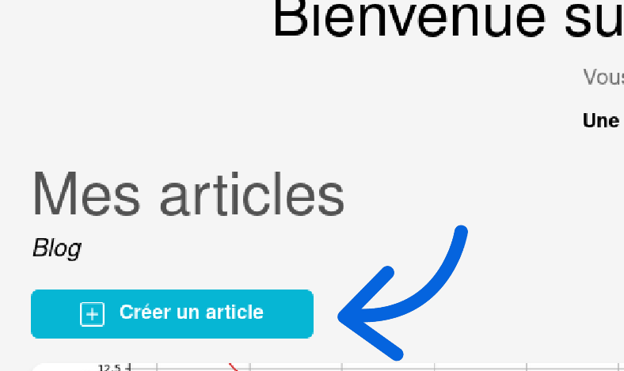
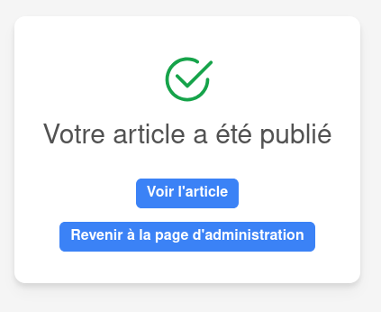

# Création d'un article

## Accéder à la page de création d'un article

La création d'un article se fait depuis la [page d'administration d'atmosphère](https://atmosphere-chartres.fr/admin/).  Une fois sur cette page, vous serez automatiquement dirigé vers la section **"Mes articles"**.

Vous serez redirigé vers un formulaire à remplir entièrement pour créer un article. 

## Remplir les informations de l'article

**Tous les champs sont obligatoires et doivent être complétés pour finaliser la création.**

La rédaction de l’article se fait étape par étape, et vous pouvez à tout moment revenir en arrière pour modifier un champ en cliquant sur le bouton **"Revenir en arrière"**.

Une fois votre article rédigé, une prévisualisation vous montrera son apparence sur le [le blog de @tmosphère](https://atmosphere-chartres.fr/blog). En cliquant sur le bouton **"Oui, passer à la publication de mon article"**, vous verrez également un aperçu de l’article tel qu’il apparaîtra sur la [page d'accueil du site atmosphère](https://atmosphere-chartres.fr). 

Votre article restera visible sur la page d’accueil jusqu’à ce que deux nouvelles publications (article ou activité) soient publiées à leur tour.

Lorsque vous arrivez à l’étape 4 **"Mise en ligne"**, et si le résultat vous convient, cliquez sur le bouton **"Publier mon article !"** pour le mettre en ligne.

Si tout s’est bien déroulé, un message de confirmation s’affichera :

