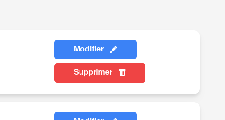

# Suppression d'une article

## Accéder à la page de gestion des activités

La suppresion d'une activité se fait depuis la [page d'administration d'atmosphère](https://atmosphere-chartres.fr/admin/). Une fois sur cette page, vous serez automatiquement dirigé vers la section **"Mes activités"**, qui affiche la liste des activités que vous avez rédigés.

## Suppression de l'activité

Pour supprimer un activité, cliquez simplement sur le bouton **"Supprimer"** situé à côté de l’activité concerné.

Après avoir cliqué, un **chargement** s'affichera (sous forme de roue tournante), puis l'activité **disparaîtra de la liste**, confirmant qu’il a bien été supprimé.