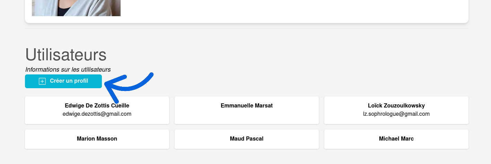

# Création d'un utilisateur

!!! warning "admin only !"

    Cette documentation est destinée uniquement aux administrateurs du site seulement.

## Accéder à la page d’ajout d’un utilisateur

La création des utilisateurs se fait depuis la [page d'administration d'atmosphère](https://atmosphere-chartres.fr/admin/). Une fois sur cette page, faites défiler jusqu'à la section **"Utilisateurs"**, puis cliquez sur le bouton **"Créer un profil"**.

Vous serez redirigé vers un formulaire à remplir entièrement pour créer un nouvel utilisateur.

## Remplir les informations de l'utilisateur / du thérapeute

**Tous les champs marqués d’un astérisque (*) sont obligatoires et doivent être complétés. De plus, l'adresse mail ne doit pas être utilisé par un autre utilisateur.**

!!! Identifiants de connexion

    Cette partie est très importante : **l’adresse e-mail et le mot de passe saisis ici ne pourront plus être modifiés par la suite.**  L’adresse e-mail affichée sur le site pourra être changée, mais **pas celle utilisée pour se connecter**. Veillez donc à bien remplir ces champs. En cas d’erreur, il faudra supprimer l’utilisateur et en recréer un nouveau.

Une fois le formulaire complété, cliquez sur "Créer le profil" pour finaliser la création.

Le champ "Liens" permet d’ajouter des liens associés à l’utilisateur :

- Le **bouton bleu** sert à modifier un lien
- Le **bouton rouge** à le supprimer
- Le **bouton vert** à en ajouter un nouveau

Vous pouvez ajouter autant de liens que nécessaire.
